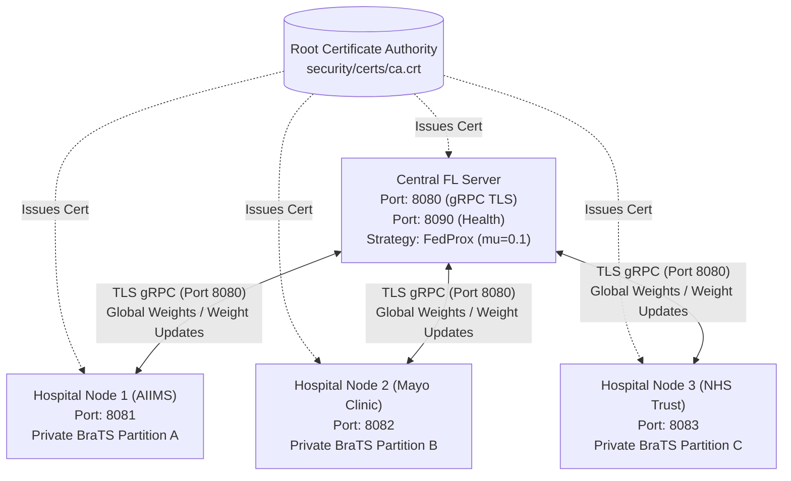
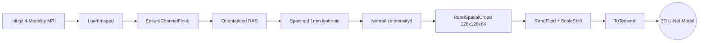
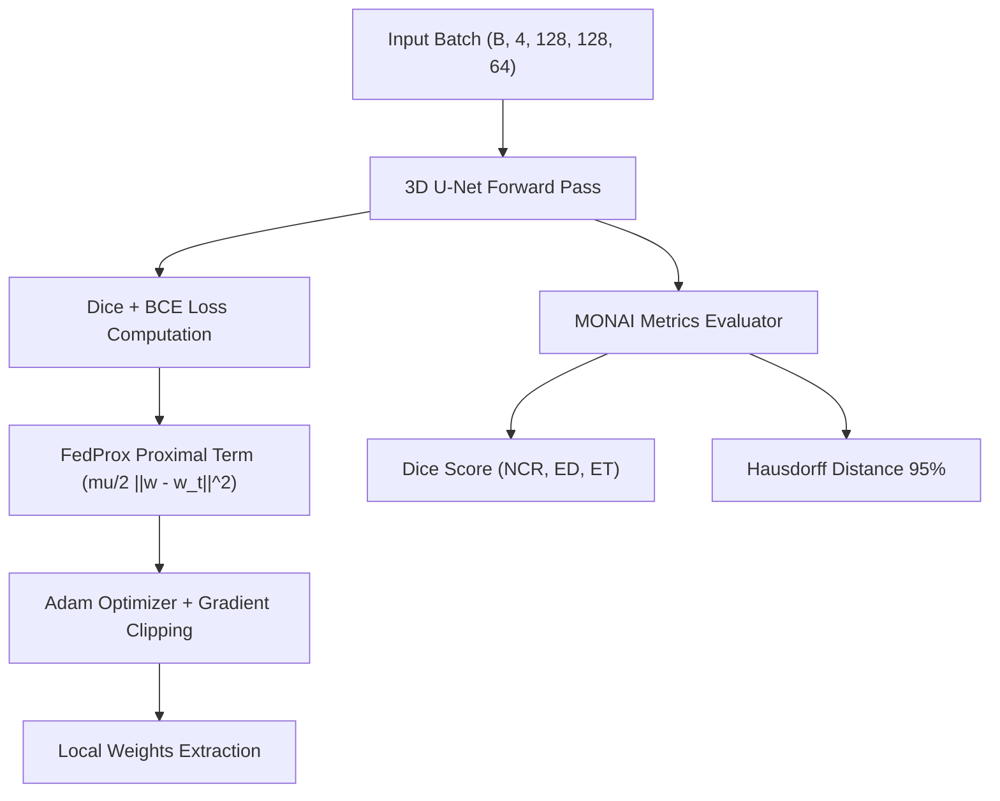

# FedMed: Cross-Silo Federated Learning Engine 🧠🏥

[](https://github.com/kushim2005/FedMed/actions/workflows/ci.yml)
[](https://www.python.org/downloads/release/python-3100/)
[](https://opensource.org/licenses/MIT)

**Domain:** Privacy-Preserving Machine Learning (PPML) & Healthcare  
**Task:** 3D Brain Tumor Segmentation on BraTS 2021 without Centralizing Patient Data

---

## 📌 Problem Statement & Use Case

Training high-accuracy deep learning models for rare and complex pathologies (such as brain tumors) demands large, diverse patient datasets. However, strict international data governance regulations (**HIPAA**, **GDPR**) strictly prohibit medical institutions from pooling raw patient medical imaging scans into centralized cloud repositories.

**FedMed** addresses this dilemma by deploying isolated hospital client nodes to three global healthcare institutions:
1. **Hospital-A (AIIMS New Delhi)**
2. **Hospital-B (Mayo Clinic)**
3. **Hospital-C (NHS Trust London)**

Raw patient MRI volumes **never leave their respective hospital firewall**. The central server coordinates training rounds by broadcasting global model parameters, the hospitals train locally on private data partitions, and encrypted model weight updates are aggregated to iteratively refine a unified global model.

---

## 🚀 Weekly Development Progress

### 🌟 Week 1 Milestone 
* **3D U-Net Model (Chaitanya):** Built high-performance 3D U-Net with MONAI, Automatic Mixed Precision (AMP), and 3D Instance Normalization for 4-channel MRI scans (T1, T1ce, T2, FLAIR).
* **Data Pipeline (Ranjith Kumar):** Implemented a 10-step MONAI preprocessing transform pipeline (loading, reorientation to RAS, 1mm isotropic resampling, intensity normalization, foreground cropping).
* **FL Server Scaffolding (Kushi):** Deployed initial Flower (`flwr`) server using the FedProx strategy.
* **Hospital Client Nodes (Vasu Sree):** Dockerized hospital client nodes executing local training on private data partitions.
* **Integration & CI/CD (Ravi):** Set up repository structure, CI/CD automated linting and structure validation workflows.

---

### 🌟 Week 2 Milestone
* **Dirichlet Non-IID Partitioning (Ravi):** Designed and implemented `data/partition.py` using a Dirichlet distribution $\text{Dir}(\alpha=0.8)$ to simulate realistic cross-silo institutional data heterogeneity across the 3 hospitals.
* **End-to-End TLS Encryption (Kushi & Vasu Sree):** Implemented `security/generate_certs.py` and `security/tls_config.py` using Python `cryptography` to generate an X.509 Root Certificate Authority (CA), server certificate, and client certificates for encrypted gRPC traffic.
* **Enhanced FL Server V2 (Kushi):** Implemented `server/fl_server_v2.py` with TLS support, configurable **FedProx** ($\mu=0.1$) & **FedAvg**, model checkpoint saving every 5 rounds, and a `/health` HTTP probe endpoint on port 8090.
* **Fault-Tolerant Client V2 (Vasu Sree):** Implemented `client/fl_client_v2.py` with TLS channel credentials, local Adam optimizer loop, and exponential backoff reconnection logic.
* **Advanced Metrics Tracker (Ranjith Kumar):** Implemented `eval/federated_metrics.py` tracking per-round global Dice, per-class Dice (NCR, ED, ET), Hausdorff Distance (HD95), with automatic CSV/JSON exports.
* **Training Orchestrator & Demo (Chaitanya & Ravi):** Built `train/federated_train.py` and `demo/week2_demo.py` for automated multi-process and multi-node simulations.

---

## 🏗️ System Architecture & Pipelines

### 1. Federated Learning Pipeline (TLS Secured)


### 2. Medical Image Preprocessing Pipeline (MONAI)


### 3. Training & Evaluation Pipeline


---

## 👥 Team & Responsibilities

| Team Member | GitHub Username | Role & Assigned Module |
|---|---|---|
| **Chaitanya** | [`chaitanya2424`](https://github.com/chaitanya2424) | **ML Lead:** 3D U-Net Architecture & Federated Training Pipeline |
| **Ranjith Kumar** | [`Ranjith-Kumar725`](https://github.com/Ranjith-Kumar725) | **ML Engineer:** MONAI Data Preprocessing & Metrics Tracking |
| **Kushi** | [`kushim2005`](https://github.com/kushim2005) | **FL Systems Lead:** Flower FL Server (FedProx/FedAvg) & TLS PKI |
| **Vasu Sree** | [`Vasusree-Boddapu`](https://github.com/Vasusree-Boddapu) | **Backend / DevOps:** Hospital Client Nodes, Docker & Resilience |
| **Ravi** | [`Ravi-attada`](https://github.com/Ravi-attada) | **DevOps & Integration:** Dirichlet Partitioner, CI/CD & Configuration |

*Daily progress logs for all 5 team members across all 28 days are maintained in the [`progress/`](progress/) directory.*

---

## ⚡ Quickstart & Running the Demo

### 1. Installation
Clone the repository and install the dependencies:
```bash
git clone https://github.com/kushim2005/FedMed.git
cd FedMed
pip install -r requirements.txt
```

### 2. Generate TLS Certificates
Generate the Root CA and mutual TLS certificates:
```bash
python security/generate_certs.py
```

### 3. Run Week 2 Federated Training Demo
Run the automated multi-node federated training simulation:
```bash
python demo/week2_demo.py
```
This script will:
1. Verify TLS certificates in `security/certs/`.
2. Partition the BraTS cases across the 3 hospital silos using Dirichlet distribution.
3. Start the secure central server on port `8080` (and health check on port `8090`).
4. Launch the 3 hospital clients concurrently to train locally and aggregate weights.
5. Save model checkpoints to `checkpoints/` and metrics to `results/`.
