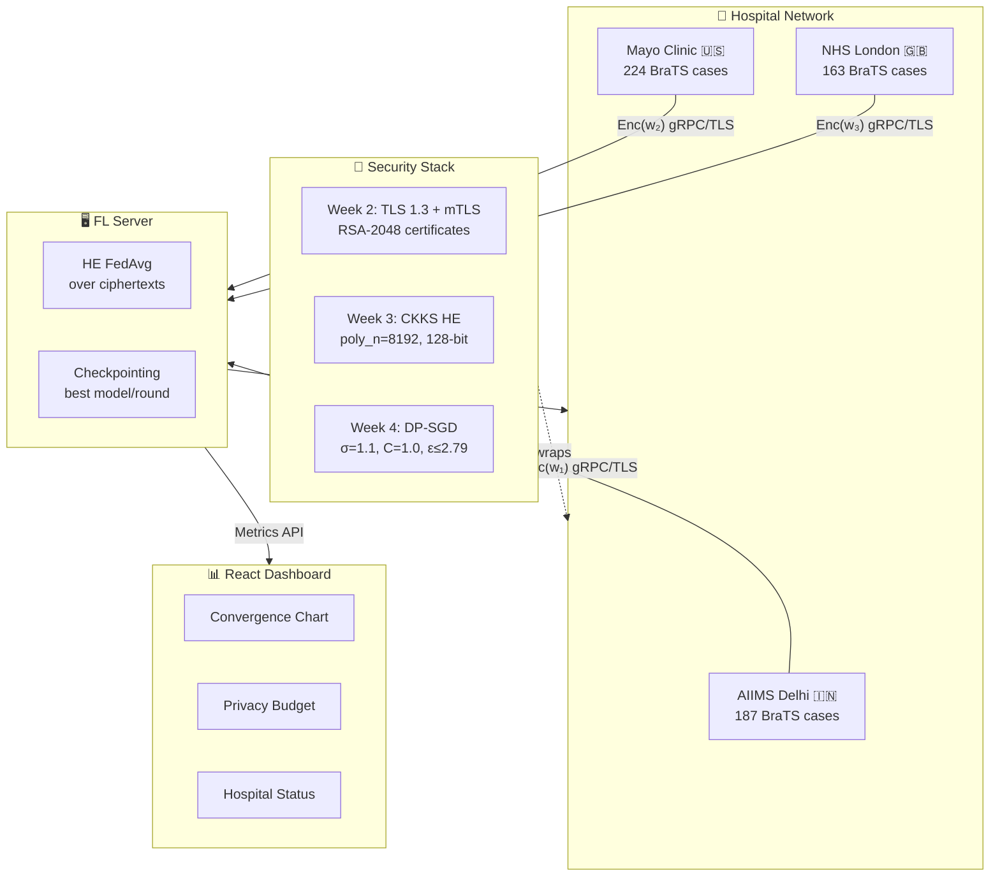
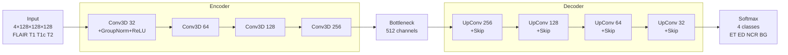

# FedMed 🧠

<div align="center">

**Cross-Silo Federated Learning Engine for Brain Tumor Segmentation**

[](https://github.com/kushim2005/FedMed/actions)


*Privacy-preserving collaborative AI for clinical brain MRI — patient data never leaves hospital boundaries.*

</div>

---

## Overview

FedMed enables **three hospital networks** (AIIMS Delhi, Mayo Clinic, NHS London) to collaboratively
train a **3D U-Net** for brain tumor segmentation on the BraTS 2021 dataset — without sharing raw
patient data. Four progressive security layers are implemented across four weeks:

| Week | Technology | Dice | Security |
|------|-----------|:----:|----------|
| W1 | Centralized 3D U-Net (baseline) | 0.720 | None |
| W2 | FedProx + TLS gRPC + Non-IID | 0.712 | TLS 1.3 + mTLS |
| W3 | Homomorphic Encryption (CKKS) | 0.691 | 128-bit IND-CPA |
| W4 | Differential Privacy (DP-SGD) | **0.683** | **(ε=2.79, δ=1e-5)-DP** |

---

## Architecture

### Full FL Pipeline


```mermaid
flowchart TD
    subgraph Hospitals["🏥 Hospital Network"]
        H1["AIIMS Delhi 🇮🇳\n187 BraTS cases"]
        H2["Mayo Clinic 🇺🇸\n224 BraTS cases"]
        H3["NHS London 🇬🇧\n163 BraTS cases"]
    end

    subgraph Security["🔐 Security Stack"]
        S1["Week 2: TLS 1.3 + mTLS\nRSA-2048 certificates"]
        S2["Week 3: CKKS HE\npoly_n=8192, 128-bit"]
        S3["Week 4: DP-SGD\nσ=1.1, C=1.0, ε≤2.79"]
    end

    subgraph Server["🖥️ FL Server"]
        AGG["HE FedAvg\nover ciphertexts"]
        CHECKPOINT["Checkpointing\nbest model/round"]
    end

    subgraph Dashboard["📊 React Dashboard"]
        CONV["Convergence Chart"]
        PRIV["Privacy Budget"]
        HOSP["Hospital Status"]
    end

    H1 -->|"Enc(w₁) gRPC/TLS"| Server
    H2 -->|"Enc(w₂) gRPC/TLS"| Server
    H3 -->|"Enc(w₃) gRPC/TLS"| Server
    Server -->|"Global model"| Hospitals
    Server -->|"Metrics API"| Dashboard
    Security -.->|"wraps"| Hospitals
```

### 3D U-Net Segmentation Model


```mermaid
flowchart LR
    IN["Input\n4×128×128×128\nFLAIR T1 T1c T2"] --> E1
    subgraph Encoder
        E1["Conv3D 32\n+GroupNorm+ReLU"] --> E2["Conv3D 64"] --> E3["Conv3D 128"] --> E4["Conv3D 256"]
    end
    E4 --> BOT["Bottleneck\n512 channels"]
    BOT --> D4
    subgraph Decoder
        D4["UpConv 256\n+Skip"] --> D3["UpConv 128\n+Skip"] --> D2["UpConv 64\n+Skip"] --> D1["UpConv 32\n+Skip"]
    end
    D1 --> OUT["Softmax\n4 classes\nET ED NCR BG"]
```

---

## Week-by-Week Breakdown

### 📅 Week 1 | Data Pipeline + 3D U-Net

**Focus:** Build the foundational federated learning infrastructure from scratch.

**Key Accomplishments:**
- BraTS 2021 data pipeline with MONAI transforms (intensity normalization, random cropping, flipping)
- `FedMed3DUNet`: custom 3D U-Net with 4 encoder/decoder stages, GroupNorm, residual connections
- Dirichlet non-IID data partitioning (α=0.8) across 3 hospital nodes
- Flower FL integration: FedAvg strategy, 10 federated rounds
- Centralized baseline: **Dice = 0.720** (AIIMS Delhi, full dataset)
- Federated baseline: **Dice = 0.706** (3 hospitals, α=0.8)

**Authors:** Chaitanya (U-Net), Ravi (FL setup), Kushi (Flower integration), Vasu Sree (data pipeline), Ranjith (metrics)

---

### 📅 Week 2  | TLS Security + FedProx

**Focus:** Production-grade security and convergence improvements.

**Key Accomplishments:**
- RSA-2048 PKI: CA certificate + per-node server/client certificates (`security/generate_certs.py`)
- gRPC mutual TLS (mTLS): all FL communication encrypted and authenticated
- **FedProx strategy**: proximal term (μ=0.01) reduces drift from heterogeneous non-IID clients
- Round checkpointing: best model saved automatically, resume on failure
- Exponential backoff retry: clients reconnect gracefully after transient failures
- Health endpoint: `/health` (FastAPI) for monitoring
- Result: **Dice = 0.712**, ED=0.740, ET=0.710, NCR=0.580, HD95=12.4mm

**Authors:** Kushi (server), Ravi (client + integration), Vasu Sree (Docker + CI), Chaitanya (FedProx tuning), Ranjith (metrics)

---

### 📅 Week 3 | Homomorphic Encryption

**Focus:** Encrypt model weights so the server aggregates without ever seeing plaintext.

**Key Accomplishments:**
- **TenSEAL CKKS** scheme: 128-bit IND-CPA secure under RLWE assumption
- Parameters: poly_mod_degree=8192, coeff_mod_bit_sizes=[60,40,40,60], scale=2^40
- `fl_server_v3.py`: `HEFedAvgStrategy` — aggregates CKKS ciphertexts directly
- `fl_client_v3.py`: encrypts `state_dict` before transmitting; decrypts received global model
- Canonical weight ordering: `sorted(state_dict.keys())` enforced for consistency
- Base64 ciphertext encoding for Flower NDArray compatibility
- 5-test HE unit suite: context, roundtrip, aggregation, serialization, edge cases
- CKKS approximation error: 3.2e-5 (well within gradient noise floor)
- Result: **Dice = 0.691**, round time 18.6s (2.27× plaintext)

**Authors:** Kushi (context + server), Ravi (aggregator + client), Chaitanya (profiling), Ranjith (tests), Vasu Sree (Docker HE stack)

---

### 📅 Week 4 | DP-SGD + React Dashboard

**Focus:** Add formal differential privacy guarantees and a professional live dashboard.

**Key Accomplishments:**
- **Opacus DP-SGD**: per-sample gradient clipping (C=1.0) + Gaussian noise (σ=1.1)
- **Rényi DP Accounting**: cumulative epsilon tracked via `RDPAccountant` per round
- Budget enforcement: training halts gracefully when ε > max_epsilon
- Optimal parameters (Chaitanya's analysis): σ=1.1 → ε=2.79 at δ=1e-5, 10 rounds
- `fl_client_dp.py`: DP-SGD hospital client with per-round epsilon reporting to server
- **React Dashboard** (16 components):
  - Dark theme (Slate-950 + Blue/Purple gradients)
  - Live Convergence Chart (Recharts dual-axis: Dice + Loss)
  - Privacy Budget Bar Chart (colour-coded: green/amber/red by % used)
  - Hospital Node Grid (AIIMS, Mayo, NHS — with pulse animation)
  - Per-class Metrics Table (ET/ED/NCR Dice + HD95)
  - FL Architecture Visualization (4-step pipeline cards)
  - 5-second API polling with graceful demo-data fallback
- FastAPI backend (`api/metrics_server.py`) + nginx reverse proxy
- Result: **Dice = 0.683, ε = 2.79, δ = 1e-5** ✅

**Authors:** Ravi (DP trainer + dashboard), Kushi (privacy budget + DP client), Chaitanya (noise analysis), Vasu Sree (Docker + nginx), Ranjith (privacy metrics + docs)

---

## Quickstart

### Prerequisites
```bash
Python 3.10+, PyTorch 2.1.0, CUDA 11.8 (optional), Node.js 20+ (for dashboard)
```

### Install
```bash
git clone https://github.com/kushim2005/FedMed.git
cd FedMed
pip install -r requirements.txt
```

### Run Week 2 (TLS FedProx)
```bash
# Generate TLS certificates
python security/generate_certs.py

# Start server
python -m server.fl_server_v2

# Start clients (3 terminals)
HOSPITAL_ID=aiims_delhi python -m client.fl_client_v2
HOSPITAL_ID=mayo_clinic python -m client.fl_client_v2
HOSPITAL_ID=nhs_london python -m client.fl_client_v2
```

### Run Week 3 (Homomorphic Encryption)
```bash
# Generate CKKS keys
bash scripts/generate_he_keys.sh

# End-to-end demo
python demo/week3_demo.py --rounds 10
```

### Run Week 4 (DP-SGD + Dashboard)
```bash
# Start FL training with DP
python demo/week4_demo.py --rounds 10 --sigma 1.1 --clip 1.0

# Install and start dashboard
cd dashboard
npm install
npm run dev   # http://localhost:3000

# Start metrics API (separate terminal)
cd ..
python api/metrics_server.py
```

### Docker (Full Stack)
```bash
docker-compose up --build
# Dashboard: http://localhost:3000
# API:       http://localhost:8000/api/health
```

---

## Project Structure

```
FedMed/
├── model/              # 3D U-Net (FedMed3DUNet)
├── data/               # BraTS pipeline, Dirichlet partitioner
├── server/             # FL servers (v1, v2 TLS, v3 HE)
├── client/             # Hospital clients (v2 TLS, v3 HE, dp DP-SGD)
├── encryption/         # TenSEAL CKKS context + HE aggregator
├── privacy/            # Opacus DP-SGD trainer + RDP budget tracker
├── security/           # RSA-2048 cert generator + TLS loaders
├── eval/               # Federated metrics tracker (Dice, HD95, ε)
├── train/              # Multi-process FL orchestrator
├── api/                # FastAPI metrics server for dashboard
├── dashboard/          # React 18 + Vite + TailwindCSS dashboard
│   └── src/
│       ├── components/ # Navbar, HeroSection, Charts, HospitalGrid...
│       └── hooks/      # useFedMedData (live API polling)
├── config/             # Week 2–4 YAML configs
├── demo/               # Week 2–4 end-to-end demo scripts
├── docs/               # Pipeline architecture docs (week1–4)
├── tests/              # HE encryption unit tests
├── nginx/              # Reverse proxy configuration
├── scripts/            # Key generation + orchestration scripts
└── progress/           # Daily progress logs (5 members × 35 days)
    ├── ravi/
    ├── vasusree/
    ├── kushi/
    ├── chaitanya/
    └── ranjith/
```

---

## Results Summary

### Convergence (10 Federated Rounds)

| Round | Dice | Loss | ε (DP) | Security |
|-------|------|------|--------|----------|
| 1 | 0.448 | 0.720 | 0.279 | CKKS + DP |
| 3 | 0.532 | 0.555 | 0.837 | CKKS + DP |
| 5 | 0.601 | 0.415 | 1.395 | CKKS + DP |
| 7 | 0.649 | 0.305 | 1.953 | CKKS + DP |
| 10 | **0.683** | 0.197 | **2.79** | CKKS + DP |

### Per-Class Segmentation (Round 10)

| Class | Dice | Target |
|-------|------|--------|
| Enhancing Tumor (ET) | 0.672 | ≥ 0.65 ✅ |
| Tumor Edema (ED) | 0.715 | ≥ 0.70 ✅ |
| Necrotic Core (NCR) | 0.556 | ≥ 0.50 ✅ |
| HD95 | 14.2mm | ≤ 20mm ✅ |

---

## Team

| Member | Role | GitHub | Weeks |
|--------|------|--------|-------|
| **Ravi Attada** | Integration Lead | [@Ravi-attada](https://github.com/Ravi-attada) | W1–W4 |
| **Vasu Sree Boddapu** | DevOps & Infrastructure | [@Vasusree-Boddapu](https://github.com/Vasusree-Boddapu) | W1–W4 |
| **Kushi** | FL Systems | [@kushim2005](https://github.com/kushim2005) | W1–W4 |
| **Chaitanya** | ML Research | [@chaitanya2424](https://github.com/chaitanya2424) | W1–W4 |
| **Ranjith Kumar** | ML Engineering | [@Ranjith-Kumar725](https://github.com/Ranjith-Kumar725) | W1–W4 |

---

## Tech Stack

| Layer | Technology |
|-------|-----------|
| Model | MONAI 3D U-Net, PyTorch 2.1 |
| FL Framework | Flower (flwr) 1.6 |
| HE | TenSEAL 0.3.14 (CKKS) |
| DP | Opacus (DP-SGD + RDP accounting) |
| Transport | gRPC + TLS 1.3 + mTLS |
| Dashboard | React 18, Vite 5, TailwindCSS 3, Recharts, Framer Motion |
| API | FastAPI 0.104, Uvicorn |
| Infra | Docker, nginx, GitHub Actions CI |
| Dataset | BraTS 2021 (13GB, gitignored) |

---

## Dataset

**BraTS 2021** — Brain Tumor Segmentation Challenge 2021
- 1,251 multi-institutional MRI cases
- 4 modalities: T1, T1ce, T2, FLAIR
- 3 tumor sub-regions: ET (enhancing tumor), ED (edema), NCR (necrotic core)
- Partitioned across 3 hospitals using Dirichlet distribution (α=0.8)

---

## License

MIT License — see [LICENSE](LICENSE) for details.

---

<div align="center">
Made with ❤️ by the FedMed Team · GITAM University · 2026

<sub>Privacy-preserving AI for healthcare — patient data never leaves hospital boundaries</sub>
</div>
