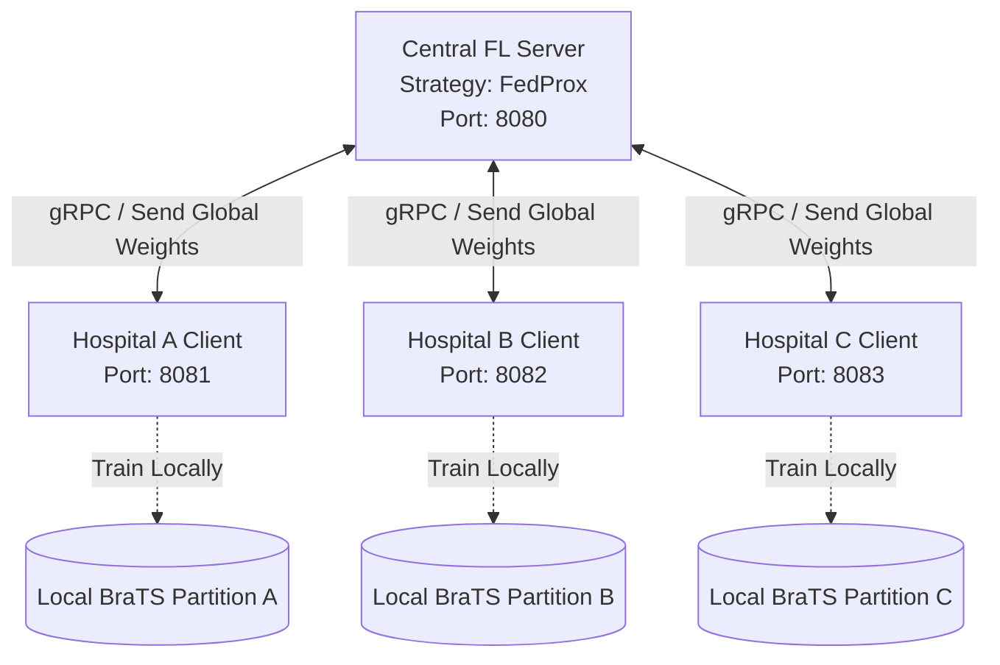
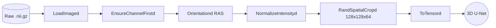
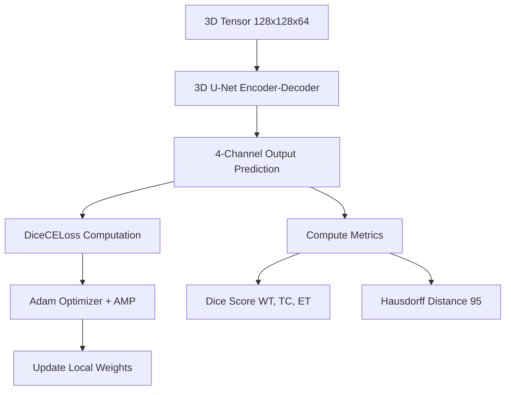
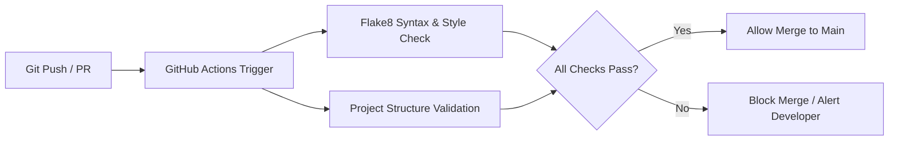

# FedMed Week 1: Pipeline Architecture

During Week 1, we successfully constructed four independent but interconnected pipelines that form the core of the FedMed engine. 

## 1. Federated Learning (FL) Pipeline
This is the core hub-and-spoke architecture that allows multiple hospitals to train the central model without sharing raw patient data.

## 2. Data Preprocessing Pipeline (MONAI)
The sequence of transformations applied to the raw BraTS 2021 NIfTI files before they are fed into the 3D U-Net.

## 3. Training & Evaluation Pipeline
The internal machine learning pipeline executed locally on each hospital node during their `fit()` loop.

## 4. Continuous Integration (CI/CD) Pipeline
The automated quality assurance pipeline triggered every time a team member pushes to GitHub.

