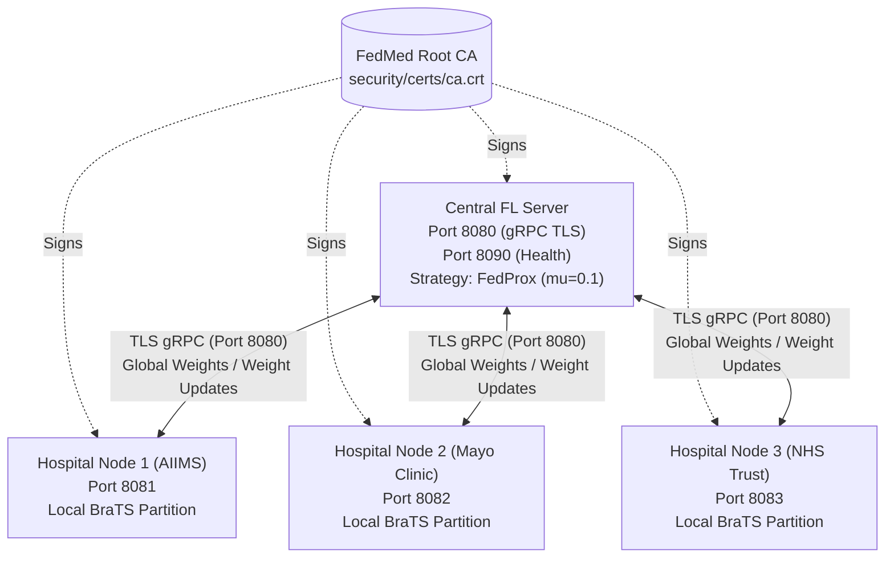

# FedMed Week 2: Pipeline Architecture & Technical Specification

## Overview

During **Week 2** (September 3 – September 23, 2026), FedMed achieved two foundational milestones:
1. **Federated Training Loop with Dirichlet Data Partitioning:** Partitioning the BraTS 2021 dataset across 3 mock hospital silos (AIIMS, Mayo Clinic, NHS Trust) with configurable statistical heterogeneity ($\alpha=0.8$) and federated aggregation via **FedProx** / **FedAvg**.
2. **Secure Communication Infrastructure:** End-to-end mutual TLS encryption over gRPC channels using X.509 certificates generated via Python's native `cryptography` library.

---

## 1. System Architecture

---

## 2. Dirichlet Non-IID Data Partitioning

Patient scans are split among the 3 hospital silos using a Dirichlet distribution $\text{Dir}(\alpha)$:
- **$\alpha = 0.8$ (Default):** Realistic cross-silo heterogeneity.
- **$\alpha \to \infty$:** Uniform (IID) distribution.
- **$\alpha \to 0$:** Extreme non-IID skew.

Raw MRI scans **never leave** their hospital boundaries. Only model parameters (weights) are communicated.

---

## 3. Communication Security (TLS / SSL)

All network traffic between hospital nodes and the central aggregator is protected by TLS:
- **Root CA:** RSA-2048 self-signed certificate (`ca.crt`, 10-year validity).
- **Server Certificate:** Signed by CA (`server.crt`, `server.key`).
- **Client Verification:** Root CA loaded into gRPC channel credentials.
