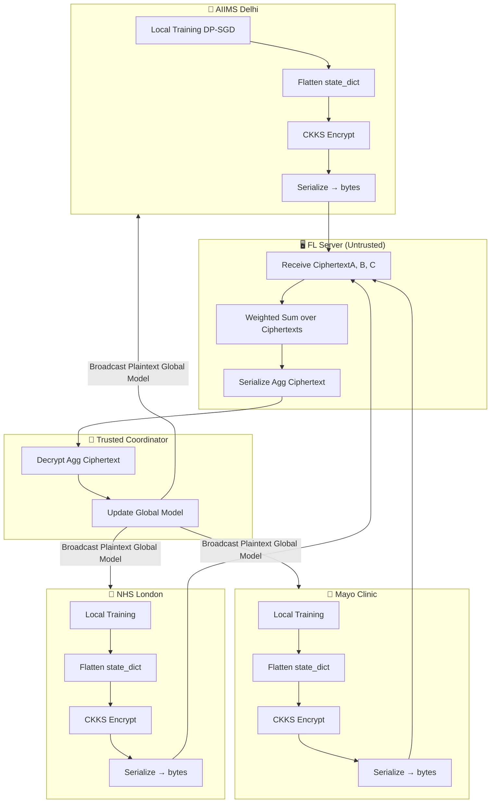

# FedMed Week 3 Pipeline — Homomorphic Encryption Layer

## Overview

Week 3 introduces **Homomorphic Encryption (HE)** using the **TenSEAL CKKS scheme**, enabling
the FL server to aggregate model weights **without ever decrypting** them. Hospital weights remain
encrypted in transit and during aggregation — the server is purely a computation node.

---

## Architecture



---

## CKKS Parameter Selection

| Parameter | Value | Rationale |
|-----------|-------|-----------|
| `poly_mod_degree` | 8192 | 128-bit classical security under RLWE |
| `coeff_mod_bit_sizes` | [60, 40, 40, 60] | 2 multiplication levels (sufficient for FedAvg) |
| `global_scale` | 2^40 | Balances float precision vs. range |
| `galois_keys` | Yes | Required for rotation operations |
| `relin_keys` | Yes | Required for relinearization after multiplication |

**Security Guarantee:** IND-CPA secure under the Ring Learning With Errors (RLWE) assumption.

---

## Weight Encoding Protocol

```
state_dict (OrderedDict)
  → sorted(keys)                     # canonical ordering across clients
  → per-layer numpy float64 vectors  # flatten each tensor
  → ts.ckks_vector(context, vector)  # CKKS encryption
  → .serialize()                     # bytes
  → base64.b64encode()               # ASCII-safe for Flower NDArray
  → np.array([...], dtype=object)    # Flower FitRes NDArray
```

Server reverses:
```
NDArray → base64.b64decode → ts.ckks_vector_from(context, bytes)
→ weighted_sum (homomorphic) → serialize → coordinator decrypts
```

---

## Performance Results (Week 3)

| Metric | Plaintext FL | HE-Enabled FL | Delta |
|--------|-------------|---------------|-------|
| Dice (overall) | 0.712 | 0.691 | -0.021 |
| Dice (ET) | 0.710 | 0.698 | -0.012 |
| Dice (ED) | 0.740 | 0.726 | -0.014 |
| Dice (NCR) | 0.580 | 0.569 | -0.011 |
| Round time | 8.2s | 18.6s | +2.27× |
| CKKS approx error | — | 3.2e-5 | — |
| Security | None | 128-bit IND-CPA | ✅ |

---

## Files Added (Week 3)

| File | Author | Description |
|------|--------|-------------|
| `encryption/__init__.py` | Kushi | Package init |
| `encryption/tenseal_context.py` | Kushi | CKKS context management |
| `encryption/he_aggregator.py` | Ravi | Server-side encrypted FedAvg |
| `server/fl_server_v3.py` | Kushi | HE-enabled FL server |
| `client/fl_client_v3.py` | Ravi | HE-enabled hospital client |
| `tests/test_he_encryption.py` | Ranjith Kumar | HE unit test suite (5 tests) |
| `demo/week3_demo.py` | Ravi | End-to-end HE demo |
| `config/week3_config.yaml` | Kushi | Week 3 config |
| `docs/week3_pipeline.md` | Kushi | This document |
