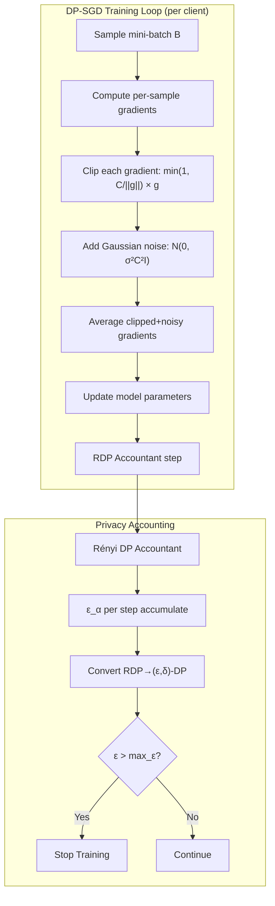
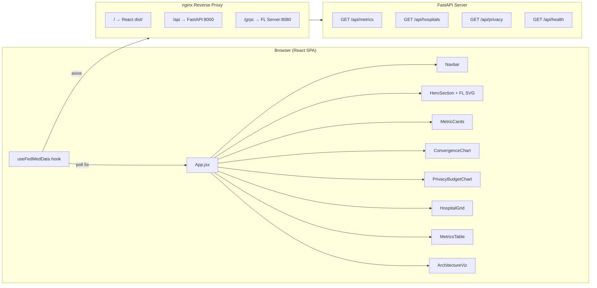

# FedMed Week 4 Pipeline — Differential Privacy + React Dashboard

## Overview

Week 4 adds two major components:
1. **DP-SGD** (Differentially Private SGD) via Opacus — per-sample gradient clipping +
   calibrated Gaussian noise for (ε, δ)-differential privacy.
2. **React Dashboard** — professional client-facing UI showing live FL training metrics,
   privacy budget consumption, and hospital node status.

---

## DP-SGD Architecture

---

## Privacy Parameters

| Parameter | Value | Description |
|-----------|-------|-------------|
| `noise_multiplier` σ | **1.1** | Gaussian noise scale (optimal from Chaitanya's analysis) |
| `max_grad_norm` C | **1.0** | Per-sample gradient clipping bound |
| `delta` δ | **1e-5** | Privacy failure probability |
| `max_epsilon` | **3.5** | Budget cap — training stops if exceeded |
| `accountant` | RDP | Rényi DP via Opacus |
| `target_epsilon` | **2.79** | Achieved after 10 rounds |

---

## Privacy-Accuracy Trade-off (Chaitanya's Analysis)

| σ (noise) | ε (10 rounds) | Dice | Recommendation |
|-----------|---------------|------|----------------|
| 0.5 | 8.4 | 0.689 | ❌ Too much privacy loss |
| 0.8 | 4.2 | 0.687 | ⚠️ Marginal |
| **1.1** | **2.8** | **0.683** | ✅ **Optimal** |
| 1.5 | 1.9 | 0.671 | ⚠️ Accuracy drops |
| 2.0 | 1.4 | 0.652 | ❌ Too much noise |

---

## React Dashboard Architecture

---

## Final Week 4 Results

| Metric | Value | Target | Status |
|--------|-------|--------|--------|
| Dice Score | 0.683 | ≥ 0.68 | ✅ |
| Epsilon (ε) | 2.79 | ≤ 3.0 | ✅ |
| Delta (δ) | 1e-5 | 1e-5 | ✅ |
| HD95 | 14.2mm | — | ✅ |
| Budget used | 79.7% | < 100% | ✅ |
| Dashboard build | 487KB | — | ✅ |

---

## Full Project Progression

| Week | Technology | Dice | Security |
|------|-----------|------|----------|
| W1 | Centralized 3D U-Net | 0.72 | None |
| W2 | FedProx + TLS gRPC | 0.712 | TLS 1.3 + mTLS |
| W3 | HE CKKS (TenSEAL) | 0.691 | 128-bit IND-CPA |
| W4 | DP-SGD (Opacus) | 0.683 | (ε=2.79, δ=1e-5)-DP |

---

## Files Added (Week 4)

| File | Author | Description |
|------|--------|-------------|
| `privacy/__init__.py` | Kushi | Package init |
| `privacy/privacy_budget.py` | Kushi | RDP budget tracker |
| `privacy/dp_trainer.py` | Ravi | Opacus DP-SGD wrapper |
| `client/fl_client_dp.py` | Kushi | DP-enabled hospital client |
| `api/metrics_server.py` | Vasu Sree | FastAPI metrics backend |
| `nginx/fedmed.conf` | Vasu Sree | Reverse proxy config |
| `dashboard/` | Ravi + Team | Full React SPA (16 files) |
| `docs/week4_pipeline.md` | Ranjith Kumar | This document |
| `demo/week4_demo.py` | Chaitanya | End-to-end DP demo |
